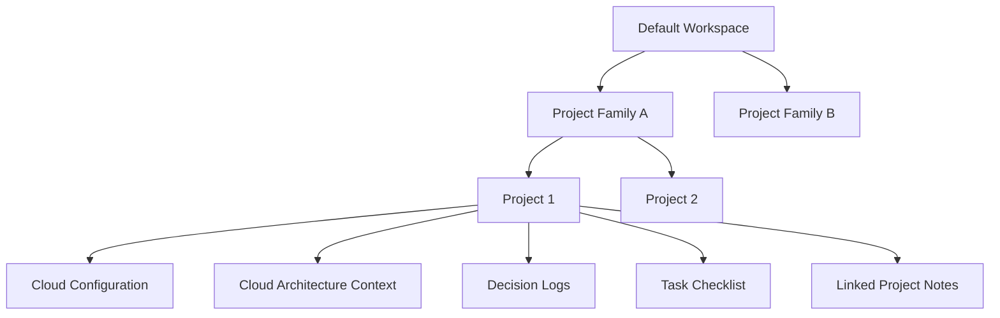

# CoeX Functional Specification v1.0

This document defines the functional specification, information architecture, and core system workflows for CoeX.

---

## 1. Project Overview & Philosophy

### Primary Purpose
CoeX is a local-first Project Knowledge & Context Management System. It serves as a permanent memory layer for projects based on cloud infrastructure and architecture, keeping your environment context secure, isolated, model-agnostic, and optimized for AI-assisted workflows.

### Core Philosophy
* **Project-Centricity**: Everything in CoeX revolves around the **Project** as the highest-level functional entity.
* **Model-Agnostic Context**: Rather than locking into a single AI chat provider, CoeX compiles environment and codebase specs into generic, copyable markdown contexts suitable for any LLM.
* **Local Privacy**: 100% of data (SQLite schemas and uploaded architectures) resides strictly on the local machine.

---

## 2. Information Architecture & Hierarchy

### Hierarchy Definitions:
1. **Workspace**: The root database container (currently defaulted to `Default Workspace` in UI, supporting multi-tenant growth).
2. **Family**: Grouping structures to organize related development scopes (e.g., "Web Apps", "Cloud Infrastructures").
3. **Project**: The core development target containing active code context, architectures, decisions, checklists, and notes.

---

## 3. UI/UX & Notepad Workspace Layout

CoeX implements a structured, multi-pane development layout:

### Global Navigation Sidebar
* Displays full-text navigation options (Dashboard, Projects, Families, Notes, Search, Activity, Settings) with the CoeX brand logo and theme toggle.

### Notes Workspace
The notes tab is structured as a three-pane development studio:
* **Left Notes List Pane**: Displays searchable note cards sorted by pinned status for project and global notes.
* **Center Editor Panel**: Plain-text editor with line numbers, code counts, soft wrap, and manual save actions.
* **Right Prompt Compiler Pane**: Selects project target, links optional active tasks, compiles prompt markdown, and hosts safety check actions.

---

## 4. Key Functional Modules

### Cloud Architecture & Parser Section
Within any project's Architecture tab, users can:
* Select active cloud environment targets (AWS, GCP, Azure).
* Upload infrastructure configuration files including:
  * **Terraform State Files (`.tfstate`)**: Extracts active resource trees, ingress paths, security groups, and provider targets.
  * **Draw.io Diagrams (`.drawio`, `.xml`)**: Extracts node labels, networking shapes, and subnet tags.
  * **Visio Diagrams (`.vsdx`)**: Parses shape metadata.
* Generate **Architecture Overview** blocks and **Security Improvements & Recommendation** checklists.

### Prompt Engineering notepad
* **Templates**:
  * *Standard Prompt*: Merges project overview details, architecture, improvement recommendations, and notes content.
  * *Instructional System*: Embeds cloud provider constraints and security rules.
  * *Rephrase Reply*: Generates drafts optimized for communicating project milestones or pull requests.
* **Task Context Injection**: Links prompts to active project tasks, automatically formatting title, status, priority, and description guidelines into the context block.
* **Safety Leak Checker**: Scans compiled prompts against default security heuristics (API keys, secret keys, emails) and user-defined custom leak keywords (managed in Settings) before copy actions.

### Task & Decision logs
* **Task Checklist**: Inline todo tracker for project milestones.
* **Decision Records**: Log architectural choices, alternatives considered, technical reasoning, and outcomes.
